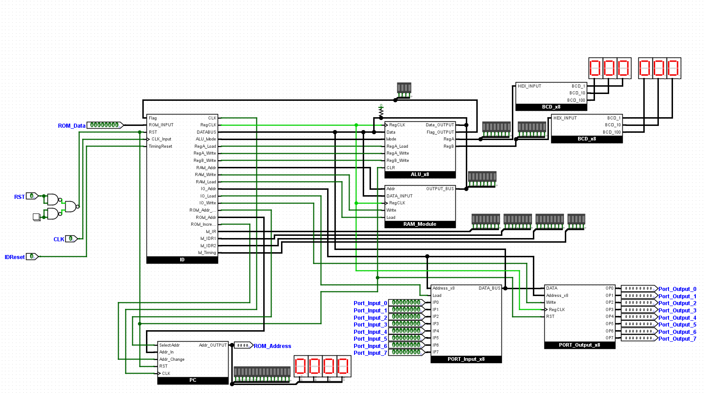
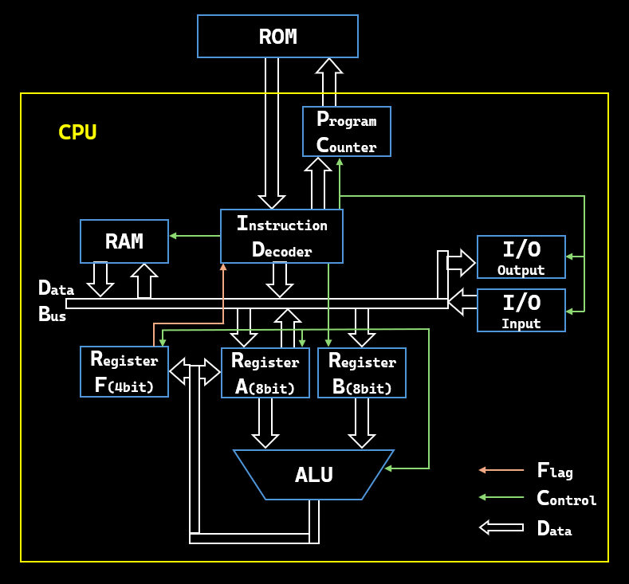

# 8bit-NANDCPU
自作CPUというものを知ってから，初めて作ったNANDCPUです．
SNSで自作したCPUを発信している人を見つけて，作りたくなったので作りました．
[Logisim-Evolution](https://github.com/logisim-evolution/logisim-evolution)上で動作します．


### 開発環境
- シミュレーター
  [**Logisim-Evolution**](https://github.com/logisim-evolution/logisim-evolution) **v4.0.0**

### 仕様
- **データバス** 8bit
- **アドレスバス** 16bit
  RAMとROMのアドレス空間は分離しており，16bitに拡張したのはROMのみです．
  - RAM 0x00~0xFF (8bit)
  - ROM 0x0000~0xFFFF (16bit)
- **実行命令数** 32個
  - **ALU命令** 7種類
    - 加算
    - 減算
    - AND演算
    - OR演算
    - EXOR演算
    - 上下シフト演算
  - **MOV命令** 14種類
    レジスタ，RAM，IO値の移動
  - **JNP命令** 11種類
    PCを指定値に置き換え
- **レジスタ数** 3個
  8bit A, B ALU直結
  4bit フラグレジスタ（ゼロ，サイン，キャリー，オーバーフロー）

#### 特徴
- **ハーバードアーキテクチャ**
  RAMとROMのアドレス空間が完全に分離されています．
- **自作命令セット**
  既存の命令セットを使用せず，完全に自己流で命令セットを実装しました．
- **可変長命令**
  1Byte~3Byteの範囲で書く命令の長さが異なります．
- **レジスタの書き込みタイミング**
  レジスタやRAMへの書き込みがクロックの立下りのタイミングで行われます．

## 詳細
### 構成
以下は，このCPUの構成です．


### 命令セット
#### MOV命令系
|1Byte|2Byte|3Byte|説明|
|--|--|--|--|
|**オペコード**|**オペランド**|**オペランド**|~~~|
|**0x00**|None|None|Nop命令|
|**0x01**|value|None|Aレジスタへ即値を保存|
|**0x02**|RAMaddress|None|AレジスタへRAMの値を保存|
|**0x03**|None|None|BレジスタにAレジスタの値を保存|
|**0x04**|value|None|Bレジスタへ即値を保存|
|**0x05**|RAMaddress|None|BレジスタへRAMの値を保存|
|**0x06**|RAMaddress|value|RAMへ即値を保存|
|**0x07**|RAMaddress|None|RAMへAレジスタの値を保存|
|**0x08**|IOaddress|None|Aレジスタへ入力ポートの値を保存|
|**0x09**|IOaddress|None|Bレジスタへ入力ポートの値を保存|
|**0x0a**|RAMaddress|IOaddress|RAMへ入力ポートの値を保存|
|**0x0b**|IOaddress|None|出力ポートへAレジスタの値を保存|
|**0x0c**|IOaddress|RAMaddress|出力ポートへRAMの値を保存|
|**0x0d**|IOaddress|value|出力ポートへ即値を保存|

#### ALU演算命令系
|1Byte|2Byte|3Byte|説明|
|--|--|--|--|
|**オペコード**|**オペランド**|**オペランド**|~~~|
|**0x20**|None|None|Aレジスタ+Bレジスタ の結果をAレジスタへ保存|
|**0x21**|None|None|Aレジスタ-Bレジスタ の結果をAレジスタへ保存|
|**0x22**|None|None|Aレジスタ&Bレジスタ の結果をAレジスタへ保存|
|**0x23**|None|None|Aレジスタ\|Bレジスタ の結果をAレジスタへ保存|
|**0x24**|None|None|Aレジスタ^Bレジスタ の結果をAレジスタへ保存|
|**0x25**|None|None|Aレジスタ<<1 の結果をAレジスタへ保存|
|**0x26**|None|None|Aレジスタ>>1 の結果をAレジスタへ保存|

#### ジャンプ命令系
|1Byte|2Byte|3Byte|説明|
|--|--|--|--|
|**オペコード**|**オペランド**|**オペランド**|~~~|
|**0x40**|ROMaddress<8-15>|ROMaddress<0-7>|無条件でPCを指定値へ変更|
|**0x41**|ROMaddress<8-15>|ROMaddress<0-7>|キャリーが1ならPCを指定値へ変更|
|**0x42**|ROMaddress<8-15>|ROMaddress<0-7>|ゼロが1ならPCを指定値へ変更|
|**0x43**|ROMaddress<8-15>|ROMaddress<0-7>|ゼロが0かつキャリーが0ならPCを指定値へ変更|
|**0x44**|ROMaddress<8-15>|ROMaddress<0-7>|キャリーが1またはゼロが1ならPCを指定値へ変更|
|**0x45**|ROMaddress<8-15>|ROMaddress<0-7>|ゼロが0かつサイン=オーバーフローならPCを指定値へ変更|
|**0x46**|ROMaddress<8-15>|ROMaddress<0-7>|サイン=オーバーフローならPCを指定値へ変更|
|**0x47**|ROMaddress<8-15>|ROMaddress<0-7>|サイン!=オーバーフローならPCを指定値へ変更|
|**0x48**|ROMaddress<8-15>|ROMaddress<0-7>|ゼロが1またはサイン!=オーバーフローならPCを指定値へ変更|
|**0x49**|ROMaddress<8-15>|ROMaddress<0-7>|オーバーフローが1ならPCを指定値へ変更|
|**0x4a**|ROMaddress<8-15>|ROMaddress<0-7>|サインが1ならPCを指定値へ変更|

### 回路データ
実際のCPU回路は，リポジトリ内にある`NCPx8.circ`という名前のファイルです．
#### 各回路
- **NAND_HA** NANDで構成された，1bit半加算回路です．
- **NAND_FA** NAND_HAを使用した，1bit全加算回路です．
- **NAND_Adder_x8** NAND_FAを使用した，8bit全加算回路です．
- **NAND_DFF** NANDで構成された，DFF回路です．
- **NAND_Reg_x8** NAND_DFFを使用した，8bitDFFレジスタです．
- **NAND_SubGate** NANDで構成された，入力の2の補数生成回路です．
- **NAND_SubGate_x8** NAND_SubGateを使用した，8bitの2の補数生成回路です．
- **NAND_AND** NANDで構成された，AND演算回路です．
- **NAND_AND_x8** NAND_ANDを使用した，8bitAND演算回路です．
- **NAND_OR** NANDで構成された，OR演算回路です．
- **NAND_OR_x8** NAND_ORを使用した，8bitOR演算回路です．
- **NAND_EXOR** NANDで構成された，EXOR演算回路です．
- **NAND_EXOR_x8** NAND_EXORを使用した，8bitEXOR演算回路です．
- **BitShiftor_UP_x8** 上方向ビットシフトを行う回路です．
- **BitShiftor_DW_x8** 下方向ビットシフトを行う回路です．
- **NAND_GATE_x8** NANDで構成された，8bitの入力の出力を制御する回路です．
- **NAND_MUX_x3_to_x7** NANDで構成された，3bit入力のデコーダです．
- **ALU_x8** 各演算回路を搭載した，8bitALUです．
- **BUS_OR_x6** 6x8bit種類の出力を，一か所の8bit出力にまとめる回路です．
- **BUS_OR_x2** 2x8bit種類の出力を，一か所の8bit出力にまとめる回路です．
- **BUS_NAND_MUX_x8_2** 2x8bitの入力に対応する，マルチプレクサ回路です．
- **NAND_Reg_x4** NAND_Reg_x8を使用した，4bitDFFレジスタです．
- **BUS_FLAG_Generator** 8bitの入力から，ゼロフラグとサインフラグを生成する回路です．
- **NAND_Incrementer_x16** NANDで構成された，16bitインクリメンタです．
- **M_ALL_CPU_M** CPU本体の回路です．
- **PC** プログラムカウンタです．
- **ID** 命令デコーダです．
- **ID_MUX_x3** オペコードの上位3bitから，おおまかな命令の判別を行うマルチプレクサです．命令デコーダに組み込まれます．
- **ID_MUX_x5** オペコードの下位5bitから，命令の詳細の判別を行うマルチプレクサです．命令デコーダに組み込まれます．
- **ID_BUS_Reg_x8** 8bitDFFレジスタです．命令レジスタとして命令デコーダに組み込まれます．
- **ID_TimingController** 命令の実行段階を指定するシフタです．命令デコーダに組み込まれます．
- **RAM_Module** Logisim-Evolutionに搭載されたRAMを使用するための回路です．
- **BCD_FA_x4** BCD変換で使用する，4bit加算器です．
- **BCD_if5_p3** BCD変換で使用する，入力値に応じて加算を行う回路です．
- **BCD_x8** 8bitの入力に対し，BCDへ変換を行う回路です．
- **PORT_Output_x8** 8x8bitの出力ポートです．
- **PORT_Input_x8** 8x8bitの入力ポートです．
- **BUS_GATE** トライステートバッファを用いた，8bitゲートです．
- **USE_CPU_FibonacciSequence** フィボナッチ数列のサンプル回路です．
- **MatrixLED_Controller_32x32** 入力に応じて，32x32ピクセルのマトリクスLED出力に変換する回路です． 
- **USE_CPU_MATRIX** マトリクスLEDを使用するサンプル回路です．

### アセンブラ
アセンブラは，別途Pythonで作成したものを使用しています．

#### サンプルコード
アセンブリ言語の理解をあまりせずプログラムに手を付けたため，アセンブリ言語自体も少しオレオレ規格になっています．
このサンプルコードは，即値同士の加算命令を実行します．
```
NONE          // 0x00 Nop命令

MOV-A<ROM 10  // 0x01 Aレジスタへ10(0x0a)を書き込み
MOV-B<ROM 20  // 0x04 Bレジスタへ20(0x14)を書き込み

ADD           // 0x20 Aレジスタ(10) + Bレジスタ(20) => Aレジスタへ書き込み(10+20=30)

MOV-IO<A 0    // 0x0b IOの0ポートへAレジスタの値(30)を書き込み
```
このサンプルコードを機械語に変換すると，
```
00000000  // NONE
00000001  // MOV-A<ROM
00001010  // 10(即値)
00000100  // MOV-B<ROM
00010100  // 20
00100000  // ADD
00001011  // MOV-IO<A
00000000  // 0(IOポート番号)
```
のようになります．

### サンプル実行
回路データへ，2つサンプルプログラムを用意しています．
回路名が**USE_CPU**から始まっている回路がサンプルになります．
CPUのリセット方法は，各回路にある説明を確認してください．


#### USE_CPU_FibonacciSequence
フィボナッチ数列の計算を行うサンプルです．NANDのみで作られたHEX-BCD変換回路を通し，10進数で7セグに表示されます．

#### USE_CPU_MATRIX
マトリクスディスプレイ内を，ドットが跳ね回ります．

## 今後
NCPx8をベースに，16bitCPUを新たに開発中です．
最終的にOSを動かすことを目標としています．